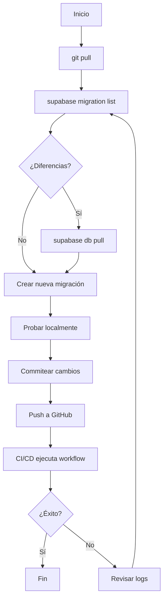

# Guía de Solución de Problemas de Migraciones

Esta guía documenta problemas comunes con migraciones de Supabase y sus soluciones.

## Problema: Migraciones Huérfanas en CI/CD

### Síntomas
```
Remote migration versions not found in local migrations directory.
Error: Process completed with exit code 1.
```

El workflow de GitHub Actions falla porque hay migraciones en la base de datos remota que no existen en el repositorio local.

### Causa
Esto ocurre cuando:
- Se ejecutan migraciones directamente en producción sin commitearlas al repositorio
- Se crea una migración en una rama que no se mergea, pero se aplica a producción
- Hay conflictos de versiones entre diferentes desarrolladores

### Solución Manual (Desarrollo Local)

1. **Verificar el estado de las migraciones:**
   ```bash
   supabase migration list
   ```

2. **Identificar migraciones huérfanas:**
   Busca líneas donde la columna `Local` esté vacía pero `Remote` tenga un valor:
   ```
   Local       | Remote         | Time (UTC)
   ------------|----------------|---------------------
               | 20260116202916 | 2026-01-16 20:29:16
   ```

3. **Marcar la migración huérfana como revertida:**
   ```bash
   supabase migration repair --status reverted 20260116202916
   ```

4. **Descargar la migración desde remoto:**
   ```bash
   supabase db pull
   ```

5. **Verificar que se descargó correctamente:**
   ```bash
   ls -la supabase/migrations/
   ```

6. **Commitear la nueva migración:**
   ```bash
   git add supabase/migrations/
   git commit -m "sync: agregar migración huérfana 20260116202916 desde remoto"
   git push
   ```

### Solución Automática (CI/CD)

El workflow `.github/workflows/deploy-and-migrate.yml` ahora incluye detección y reparación automática:

#### Paso 1: Sync and Repair Migration History
- Detecta automáticamente migraciones huérfanas comparando Local vs Remote
- Marca migraciones huérfanas como `reverted` para permitir sincronización
- Maneja casos especiales conocidos:
  - Migraciones legacy (00, 01, 02)
  - Conflicto específico (20250115)

#### Paso 2: Run Migrations
- Ejecuta `supabase db push --debug --include-all`
- Si falla, verifica nuevamente si hay migraciones huérfanas adicionales
- Proporciona instrucciones claras para resolución manual si es necesario

### Prevención

Para evitar migraciones huérfanas:

1. **Nunca ejecutar migraciones directamente en producción**
   - Siempre crear migraciones localmente
   - Commitearlas al repositorio
   - Desplegarlas vía CI/CD

2. **Usar nombres de versión únicos:**
   - Formato recomendado: `YYYYMMDDHHmmss_descripcion.sql`
   - Evitar solo fecha: `YYYYMMDD_descripcion.sql`
   - Ejemplo correcto: `20260116203045_add_user_roles.sql`

3. **Sincronizar antes de crear nuevas migraciones:**
   ```bash
   git pull
   supabase migration list  # verificar estado
   supabase db pull         # descargar cualquier cambio remoto
   ```

4. **Verificar antes de mergear:**
   - Revisar que todas las migraciones locales existan en el PR
   - Ejecutar `supabase migration list` en la rama

## Problema: Conflictos de Versión de Migración

### Síntomas
```
Found migration version conflict for 20250115
Remote has 20250115 but CLI can't reconcile it with local files
```

### Causa
Múltiples migraciones comparten el mismo prefijo de fecha, causando ambigüedad:
- `20250115_descripcion1.sql`
- `20250115001_descripcion2.sql`

### Solución

1. **Renombrar migraciones locales con timestamp completo:**
   ```bash
   # Antes
   20250115_feature.sql
   
   # Después
   20250115120000_feature.sql
   ```

2. **O mover el archivo conflictivo a archive:**
   ```bash
   mv supabase/migrations/20250115_admin_maintainers.sql supabase/migrations/archive/
   ```

3. **Reparar el historial remoto:**
   ```bash
   supabase migration repair --status reverted 20250115
   ```

4. **Re-aplicar las migraciones:**
   ```bash
   supabase db push --include-all
   ```

## Problema: Error "open supabase/.temp/profile: no such file or directory"

### Síntomas
```
open supabase/.temp/profile: no such file or directory
Loading project ref from env var: ***
```

### Causa
Advertencia menor - el CLI busca un archivo de perfil temporal que no existe. No impacta la ejecución.

### Solución
- **No requiere acción** - es una advertencia benigna
- El CLI continúa usando variables de entorno correctamente
- Si deseas eliminar la advertencia, crea el directorio:
  ```bash
  mkdir -p supabase/.temp
  ```

## Comandos Útiles de Diagnóstico

```bash
# Ver estado completo de migraciones
supabase migration list --debug

# Ver diferencias entre local y remoto
supabase db diff

# Verificar conectividad
supabase projects list

# Ver logs de función específica
supabase functions logs <function-name>

# Verificar variables de entorno
supabase status
```

## Flujo Recomendado para Desarrollo



## Contacto y Soporte

Si encuentras un problema no documentado aquí:

1. Revisa los logs completos del workflow en GitHub Actions
2. Ejecuta los comandos de diagnóstico mencionados arriba
3. Documenta el problema en un issue de GitHub con:
   - Output completo de `supabase migration list`
   - Logs del workflow fallido
   - Descripción de los cambios recientes

---

**Última actualización:** 2026-01-16  
**Mantenedor:** Equipo DevOps
